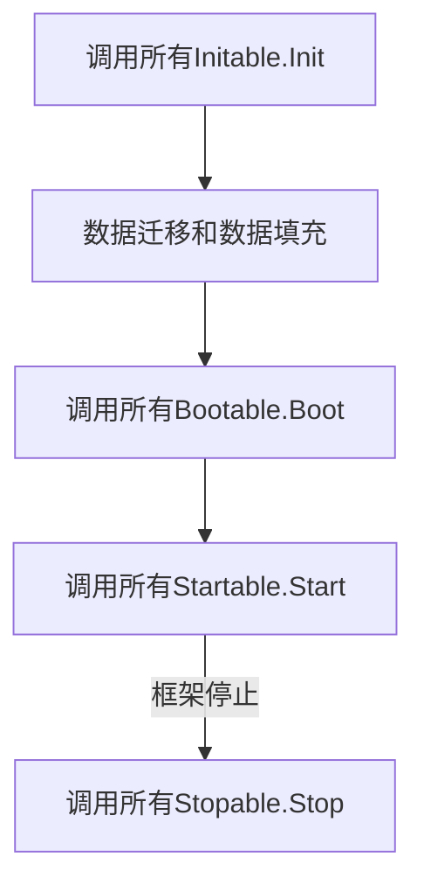

# 框架模块

在 zeddy 中， `框架模块` 是框架能够控制的最小单位。 
当一个结构体实现了 `github.com/zeddy-go/zeddy/app.Module` 接口， 它就是一个 `框架模块` 了。 
框架会通过判断 `框架模块` 是否实现**特定的**接口来决定如何使用该模块。 
至于模块中的内容怎么组织，您完全可以自由发挥。另外，您完全可以将模块作为独立的go模块编写，
并在需要的时候从远程导入。

> zeddy 推荐您垂直拆分功能，拆分后的每一块功能就是一个 `框架模块`。 
> 
> 例如一个 `用户模块` 中应该包含：
> * 用户表数据迁移和数据填充
> * 用户的数据库模型
> * 用户功能相关的业务逻辑
> * 用户功能需要暴露出来的api

> 用DDD的话来说，框架模块就是需要解决的问题的特定领域。:smile:
    我们推荐您使用类DDD的方式来构建您的应用，但是像上面说的那样，最终的决定权还是在您。

下面的代码定义了一个`框架模块`：
```go
import (
    "github.com/zeddy-go/zeddy/app"
)

type Module struct {
	app.Module
}
```
在 github.com/zeddy-go/zeddy/app/contract.go 中，我们为`框架模块`定义了一些可供实现的接口。
这些接口中的方法就是框架与`框架模块`互动的方式。
当框架启动时，会遍历所有`框架模块`，并按照如下顺序尝试调用方法。

Init方法和Boot方法主要是对`框架模块`做初始化操作，分为两个方法是为了减少各个框架模块对执行顺序的依赖。
> 细心的您应该已经察觉到，如果 config 模块不是第一个被执行，那么其他模块就有可能报错。

这个思想很简单，因为框架会将所有Init方法都执行完成后才会继续执行所有Boot方法，
所以集中在执行顺序最高的Init方法中绑定对象的New方法(也就是常说的provider)，
而在顺序第二的Boot方法中从容器中取我们需要的对象来做相应操作。
这样就可以避免因为依赖的对象还没有被实例化或者根本就还没有绑定 `provider` 而导致的问题。

Start和Stop则是运行阻塞逻辑的地方，例如启动一个http服务。
启动时，框架会以协程方式执行所有Start方法，退出时，框架会执行所有Stop方法，
然后等待所有Start方法退出。

> 请一定确保您的Start方法能正常退出，否者框架也无法退出。