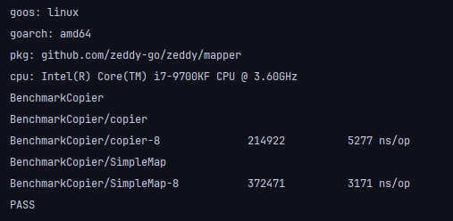

# FAQ

## 框架库中有很多反射逻辑和泛型，执行会很慢吗？
我们尝试在开发效率和执行效率之间找平衡，这里面必然要面对取舍。
反射逻辑和泛型是为了让业务代码更简单从而提高我们的开发效率。
在其他方面我们也在尝试快起来， 下面是我们的转换方法与copier的对比(github.com/zeddy-go/zeddy/mapper/simple_test.go:231):

这个地方之所以快是因为我们的实现简单，我们认为在这种地方满足通常需求即可，通过舍弃复杂性来加快执行速度。
所以在这里，我们真诚的邀请大家都参与进来，帮助我们更好的找到平衡。

> 我们听到过一些即快又快的方案，其中最常被提及的两个方案是代码生成和ai。
> 我们不反对，我们只是给出了另一个解决方案。